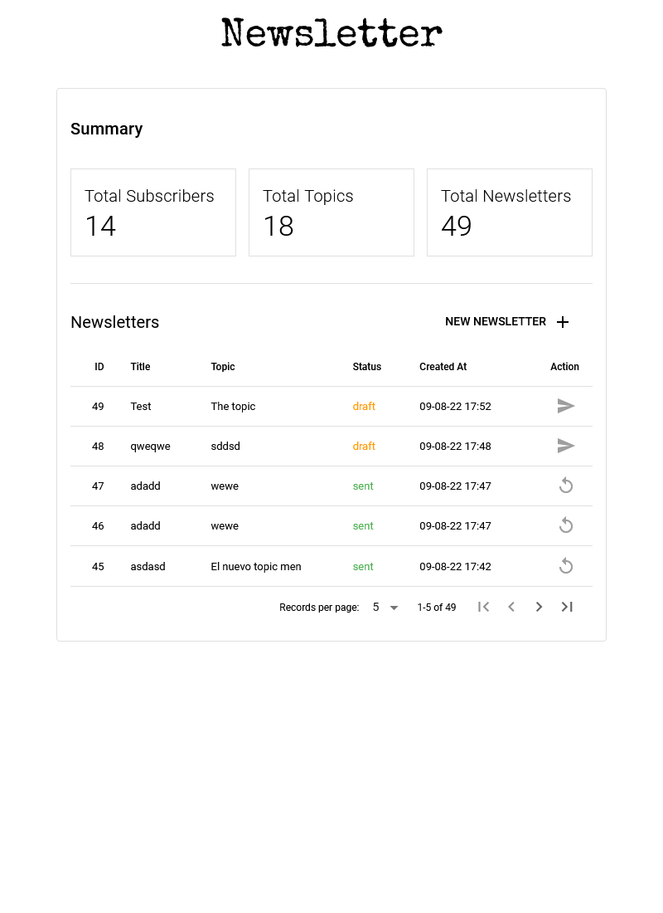
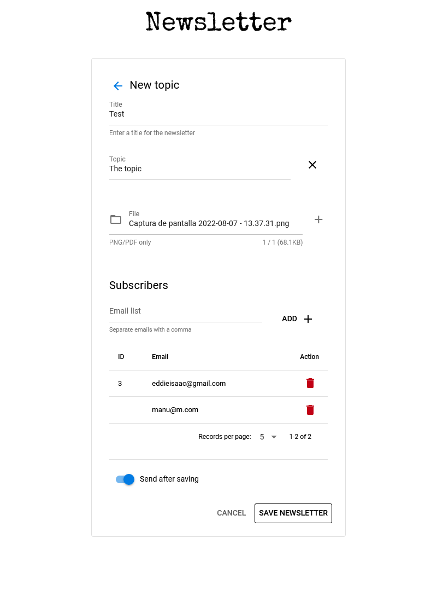
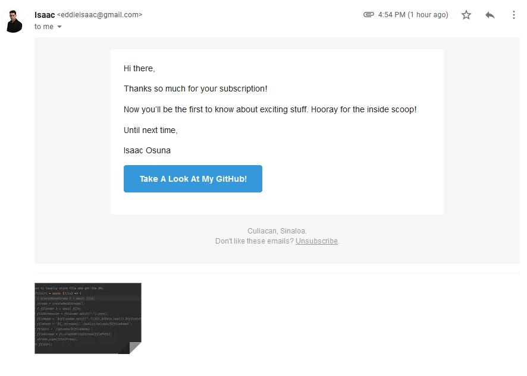

# Newsletter App
This is a newsletter app that allows you to create and send newsletters to your subscribers.
You can perform the following actions:
* Send personalized emails to your subscribers, with attachments.
* Categorize your newsletters by topic.
* Send a newsletter to a specific group of subscribers.
* Subscribe/unsubscribe users from specific topic.
* Create a newsletter to manually send later.

## Tech Stack
* Vue 3
* Pinia
* Quasar
* NodeJS
* Sequelize
* Nodemailer w/ Handlebars
* PostgreSQL

## Preview





# Installation
## Backend
Change

```bash
npm install
```

